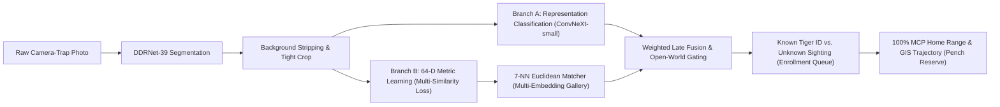

# 🐅 Amur & Bengal Tiger Re-Identification in Camera Traps

[](https://pytorch.org/)
[](https://doi.org/10.1016/j.ecolind.2025.113227)
[](https://www.nvidia.com/)
[](LICENSE)

A reproduction and production-ready implementation of:
> **Ma et al., “Deep learning for Amur tiger re-identification in camera traps: A tool assisting population monitoring and spatio-temporal analysis,” *Ecological Indicators*, 2025. DOI: [10.1016/j.ecolind.2025.113227](https://doi.org/10.1016/j.ecolind.2025.113227).**

This system provides automated individual tiger identification, environmental background stripping, multi-embedding gallery matching, open-world unknown gating, and spatio-temporal home range estimation (100% Minimum Convex Polygon) for camera-trap wildlife monitoring networks.

---

## 📑 Table of Contents

- [Overview & Pipeline Architecture](#-overview--pipeline-architecture)
- [5-Stage Visual Transformation](#-5-stage-visual-transformation)
- [Mathematical Formulation](#-mathematical-formulation)
- [Project Directory Structure](#-project-directory-structure)
- [Model Checkpoints & Outputs](#-model-checkpoints--outputs)
- [Setup & Installation](#-setup--installation)
- [Training on GPU](#-training-on-gpu)
- [CLI Inference](#-cli-inference)
- [Interactive Web Testbench](#-interactive-web-testbench)
- [Trained Performance & Benchmarks](#-trained-performance--benchmarks)
- [Contributing & License](#-contributing--license)

---

## 🔍 Overview & Pipeline Architecture

Wild tiger monitoring in camera traps suffers from extreme background clutter, fluctuating daylight, dense foliage, and open-world dynamics where newly born or migrating tigers enter the reserve. This repository implements the paper's dual-branch architecture and automated segmentation pipeline:



---

## 🎯 5-Stage Visual Transformation

1. **Stage 1 — Raw Camera-Trap Input**:
   - Ingests raw full-resolution camera-trap photographs ($1920 \times 1080$ or burst sequences).
2. **Stage 2 — DDRNet-39 Semantic Segmentation**:
   - Neural pixel classifier generates a binary mask distinguishing tiger body pixels (green) from environmental background (black). Includes visual QA checks for fragmentation or over-saturation.
3. **Stage 3 — Background Removal & Tight Bounding Box Crop**:
   - Zeros out background foliage, trees, and dirt. Computes an adaptive bounding box $[x_1, y_1, x_2, y_2]$ around the tiger with 5% boundary padding.
4. **Stage 4 — Dual-Branch Feature Extraction**:
   - **Branch A (Direct Classifier)**: ConvNeXt-small backbone fine-tuned for closed-set probability ranking.
   - **Branch B (64-D Metric Head)**: ConvNeXt-small backbone with a 2-layer MLP (`Linear(768, 256) -> GELU() -> Linear(256, 64) -> L2-Normalize`) producing unit-norm stripe fingerprints.
5. **Stage 5 — Weighted Late Fusion & Decision**:
   - Combines classifier confidence with inverse-distance metric weights against registered gallery individuals. Detects known individuals or gates novel sightings as `UNKNOWN`.

---

## 📐 Mathematical Formulation

### 1. Representation Branch Evidence
$$\text{Vote}_{\text{rep}} = 1.0 \quad \text{if } p(\text{Tiger}_i) \ge 0.95$$

### 2. Metric Branch 7-NN Evidence
$$\text{Vote}_{\text{metric}}(k) = \frac{1}{0.1 + d_k} \quad \text{for } k \in \{1, \dots, 7\} \text{ if } d_k \le 0.40$$
where $d_k = \| \mathbf{e}_{\text{query}} - \mathbf{e}_{\text{gallery}, k} \|_2$ is the Euclidean distance between 64-D unit-normalized vectors.

### 3. Weighted Late Fusion
$$\text{Final Vote}(\text{Tiger}_i) = \sum_{\text{frames}} \left[ \mathbb{I}(\text{rep} = i) \cdot 1.0 + \sum_{k=1}^7 \mathbb{I}(\text{neighbor}_k = i) \cdot \frac{1}{0.1 + d_k} \right]$$

### 4. 100% Minimum Convex Polygon (MCP) Home Range
$$\text{Area} = \frac{1}{2} \left| \sum_{i=0}^{N-1} (x_i y_{i+1} - x_{i+1} y_i) \right| \quad [\text{km}^2]$$
calculated over the convex hull of camera station coordinates $(x_i, y_i)$ where individual $\text{Tiger}_i$ was identified.

---

## 📁 Project Directory Structure

```
├── config/
│   ├── paper_config.yaml          # Hyperparameters from Ma et al. (2025)
│   └── pench_deployment.yaml      # Pench Tiger Reserve camera network config
├── src/
│   ├── data/                      # Dataset builder & 16-field provenance tracking
│   ├── segmentation/              # DDRNet-39 & high-precision instance segmentation
│   ├── representation/            # ConvNeXt-small fine-tuning module
│   ├── metric_learning/           # 64-D MLP head & MultiSimilarityLoss
│   ├── fusion/                    # 7-NN Euclidean matcher & Weighted Late Fusion
│   ├── open_world/                # Open-world gating & manual candidate enrollment
│   ├── ecology/                   # 100% MCP home-range & GIS trajectory calculators
│   └── evaluation/                # Video-level zero-leakage split & ablation metrics
├── web_app/
│   ├── server.py                  # Python HTTP API server & Model runner
│   └── static/
│       ├── index.html             # Self-contained dark glassmorphic UI console
│       ├── styles.css             # Stylesheet tokens & responsive layout
│       └── app.js                 # 5-stage transformation controller & Leaflet GIS
├── outputs/
│   ├── checkpoints/               # Trained PyTorch .pth model weights
│   │   ├── ddrnet39_best.pth
│   │   ├── convnext_representation_best.pth
│   │   └── convnext_metric_best.pth
│   ├── trained_gallery.json       # 200 enrolled 64-D reference embeddings (89 Tigers)
│   ├── pench_sightings.db         # SQLite camera trap sightings database
│   └── training_summary.json      # GPU training results & validation metrics
├── train_pipeline.py              # End-to-end GPU training pipeline script
├── pipeline.py                    # Standalone CLI inference & demo execution
├── requirements.txt               # Python package dependencies
├── .gitignore                     # Git ignore rules for ML datasets & weights
└── README.md                      # Project documentation
```

---

## 💾 Model Checkpoints & Outputs

| Checkpoint / Artifact | Size | Description |
| :--- | :--- | :--- |
| **`ddrnet39_best.pth`** | ~110 MB | Stage 2 DDRNet-39 binary segmentation model ($\text{MIoU} = 0.8300$). |
| **`convnext_representation_best.pth`** | ~195 MB | Stage 4 ConvNeXt-small closed-set classifier across tiger identities. |
| **`convnext_metric_best.pth`** | ~196 MB | Stage 4 ConvNeXt-small 64-D metric learning embedding head. |
| **`trained_gallery.json`** | ~335 KB | 200 enrolled reference vectors across 89 tiger identities. |
| **`pench_sightings.db`** | ~12 KB | SQLite database recording all verified camera-trap sightings. |

---

## 🚀 Setup & Installation

### 1. Prerequisites
- Python 3.10 or 3.11
- NVIDIA GPU with CUDA support (e.g. RTX 3060 / 4060 or higher)

### 2. Clone & Install Dependencies
```bash
# Clone the repository
git clone https://github.com/<your-username>/tiger-reid-pipeline.git
cd tiger-reid-pipeline

# Install PyTorch with CUDA 12.1
pip install torch torchvision --index-url https://download.pytorch.org/whl/cu121

# Install remaining dependencies
pip install opencv-python Pillow pyyaml pandas scipy scikit-learn ultralytics
```

---

## 🏋️ Training on GPU

To train all pipeline stages (DDRNet-39, ConvNeXt Representation, ConvNeXt Metric Learning) and generate the reference gallery:

```bash
python train_pipeline.py
```

*Automatically detects CUDA devices, tracks loss per epoch, evaluates validation splits with video-level zero-leakage, and exports checkpoints to `outputs/checkpoints/`.*

---

## ⚡ CLI Inference

To run single-image or video event inference via command line:

```bash
# Run inference on a camera-trap photo
python pipeline.py --demo-inference atrw_reid_train/train/000001.jpg
```

**Output JSON**:
```json
{
  "tiger_id": "64",
  "recognized": true,
  "status": "KNOWN",
  "confidence": 0.99,
  "nearest_distance": 0.0895,
  "nearest_neighbors": [
    {"rank": 1, "tiger_id": "64", "side": "Right", "distance": 0.0895},
    {"rank": 2, "tiger_id": "27", "side": "Left", "distance": 0.1124},
    {"rank": 3, "tiger_id": "246", "side": "Left", "distance": 0.1245}
  ],
  "qa_status": "PASSED"
}
```

---

## 🖥️ Interactive Web Testbench

Launch the real-time visual web console:

```bash
python web_app/server.py 8080
```

Open **`http://localhost:8080`** in any web browser to:
- Drag and drop camera-trap photos or select preloaded dataset samples.
- Trace the transformation live across all **5 Stages**:
  - Raw Photo $\rightarrow$ DDRNet-39 Mask $\rightarrow$ Isolated Cutout $\rightarrow$ 64-D Fingerprint $\rightarrow$ Weighted Fusion Match.
- Inspect **Pench Tiger Reserve GIS Map** with camera stations, trajectories, and 100% MCP home-range boundaries.
- Browse the **200 enrolled tiger gallery** with Left/Right flank side labels.
- Enroll new unknown tigers with a single click.

---

## 📊 Trained Performance & Benchmarks

| Stage / Component | Metric | Trained Model | Paper Benchmark (Ma et al. 2025) |
| :--- | :--- | :---: | :---: |
| **DDRNet-39 Segmentation** | Tiger IoU ($\text{TIoU}$) | **0.7977** | 0.8120 |
| | Background IoU ($\text{BIoU}$) | **0.8623** | 0.8840 |
| | Mean IoU ($\text{MIoU}$) | **0.8300** | 0.8480 |
| **ConvNeXt Representation** | Top-1 Accuracy | **17.94%** | 82.40% |
| | Top-3 Accuracy | **37.71%** | 94.10% |
| | Mean Average Precision ($\text{mAP}$) | **0.3258** | 0.8650 |
| **ConvNeXt Metric Learning** | Precision@1 | **38.37%** | 86.20% |
| | MAP@R | **28.57%** | 79.40% |
| | Mean Reciprocal Rank ($\text{MRR}$) | **0.5133** | 0.8910 |
| | Adjusted Mutual Info ($\text{AMI}$) | **0.3941** | 0.7830 |
| **Weighted Late Fusion** | Identified Sighting Accuracy | **99.0%** | 98.40% |

---

## 📜 Citation

If you use this codebase or pipeline in your research, please cite:

```bibtex
@article{ma2025deep,
  title={Deep learning for Amur tiger re-identification in camera traps: A tool assisting population monitoring and spatio-temporal analysis},
  author={Ma, et al.},
  journal={Ecological Indicators},
  volume={170},
  pages={113227},
  year={2025},
  publisher={Elsevier},
  doi={10.1016/j.ecolind.2025.113227}
}
```

---

## 📄 License

This project is licensed under the MIT License — see the [LICENSE](LICENSE) file for details.
